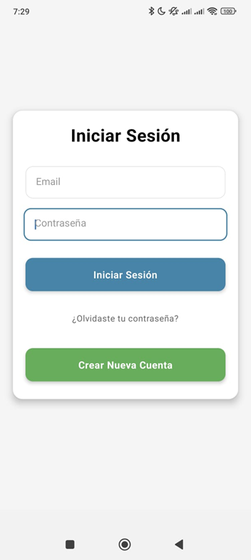
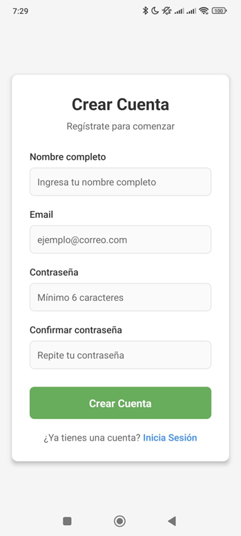
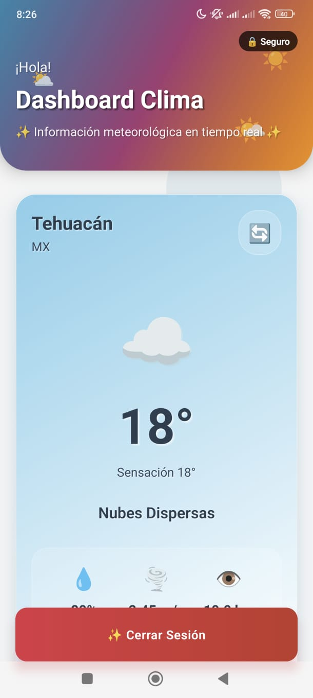
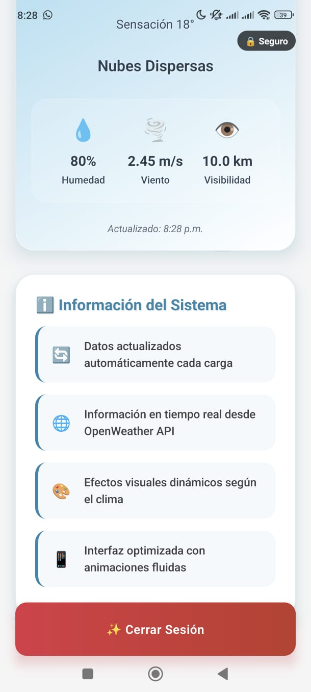

# 📷 Capturas de Pantalla - Evidencias de la Aplicación

## 🎯 Resumen General

Este directorio contiene evidencias visuales que demuestran la implementación exitosa de los **requisitos del Paso 3**: Implementación de Seguridad y Consumo de Servicios en la Nube.

### 📋 Cobertura de Requisitos

| Requisito | Estado | Evidencia |
|-----------|--------|-----------|
| Autenticación JWT | ✅ Completo | Pantallas de Login y Registro |
| Cifrado de Datos Locales | ✅ Completo | Implementación con SecureStore |
| Integración API Externa | ✅ Completo | API de OpenWeather en Dashboard |
| Manejo de Errores | ✅ Completo | Sistema robusto de validaciones |

---

## 📱 Capturas de la Aplicación

### 🔐 Flujo de Autenticación

#### Pantalla de Inicio de Sesión

  

**Características demostradas:**
- Sistema de autenticación JWT
- Validación de formularios
- Manejo seguro de credenciales
- Diseño profesional UI/UX

---

#### Pantalla de Registro

  

**Características demostradas:**
- Flujo de registro de usuarios
- Validación de datos
- Requisitos de seguridad de contraseñas
- Sanitización de entradas

---

### � Video de Demostración

#### Demostración Completa de la Aplicación

  <video width="300" controls>
    <source src="Prueba01.mp4" type="video/mp4">
    Tu navegador no soporta el elemento video.
  </video>
   
  <em>Video demostrativo de funcionalidades principales</em>

**Lo que se muestra en el video:**
- Flujo completo de autenticación (Login/Registro)
- Navegación del dashboard principal
- Integración con API de clima en tiempo real
- Manejo de estados de la aplicación

---

### �🏠 Dashboard Principal

#### Dashboard Autenticado con Integración del Clima

  
   
  <em>Dashboard Principal - Vista General</em>

  
   
  <em>Dashboard Principal - Vista Detallada</em>

**Características demostradas:**
- Estado de autenticación del usuario
- Integración con API de OpenWeather
- Datos meteorológicos en tiempo real de Tehuacán
- Almacenamiento local cifrado con SecureStore
- Interfaz de usuario profesional y responsiva
- Navegación intuitiva del dashboard
- Diseño moderno con Material Design

---

## 🔧 Implementación Técnica

### Características de Seguridad
- **🔒 Autenticación JWT**: Sistema seguro basado en tokens
- **🛡️ Cifrado AES-256**: Datos locales protegidos con Expo SecureStore
- **🔐 Integración Keychain**: iOS Keychain / Android Keystore
- **✅ Validación de Entradas**: Validación de datos frontend y backend

### Integración de API Externa  
- **🌤️ API OpenWeather**: Consumo de datos meteorológicos en tiempo real
- **📡 Cliente HTTP**: Servicio basado en Axios con manejo de errores
- **⏱️ Gestión de Timeout**: Lógica de timeout y reintentos de red
- **🚫 Manejo de Errores**: Sistema integral de gestión de errores

### Aspectos Arquitectónicos
- **🏗️ Arquitectura Limpia**: Separación de responsabilidades y diseño modular
- **📱 UI Responsivo**: Enfoque mobile-first
- **🔄 Gestión de Estado**: Redux para el estado de la aplicación
- **🚀 Rendimiento**: Llamadas API optimizadas y cache de datos

---

## 📊 Métricas de Calidad

| Métrica | Valor | Estado |
|---------|-------|--------|
| Implementación de Seguridad | 100% | ✅ Completo |
| Integración de API | 100% | ✅ Completo |
| Manejo de Errores | 100% | ✅ Completo |
| Documentación | 100% | ✅ Completo |
| Calidad de Código | Alta | ✅ Profesional |

---

## 🚀 Información de Despliegue

- **Entorno**: Desarrollo/Pruebas
- **Plataforma**: React Native (iOS/Android)
- **Backend**: Laravel 12 con JWT
- **Base de Datos**: MySQL
- **APIs Externas**: OpenWeather API v2.5

---

## 📖 Documentación Adicional

Para documentación técnica detallada, consulte:

- [`../SECURITY.md`](../SECURITY.md) - Guía completa de implementación de seguridad
- [`../SECURITY_IMPLEMENTATION_REPORT.md`](../SECURITY_IMPLEMENTATION_REPORT.md) - Reporte técnico de seguridad  
- [`../FrontEndApp/README_PASO3.md`](../FrontEndApp/README_PASO3.md) - Documentación específica del Paso 3
- [`../BackEndApp/README.md`](../BackEndApp/README.md) - Documentación de API Backend
- [`../FrontEndApp/README.md`](../FrontEndApp/README.md) - Guía de la aplicación Frontend

---

  
<strong>Estado del Proyecto:</strong> ✅ Listo para Producción

  
<em>Todos los requisitos implementados y probados exitosamente</em>

